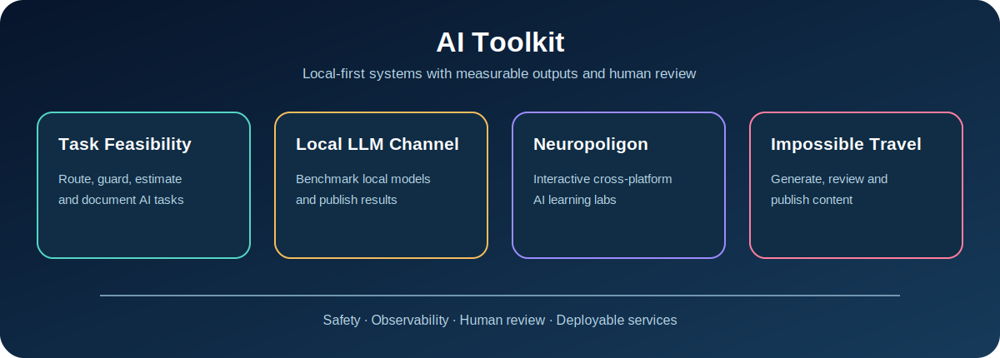
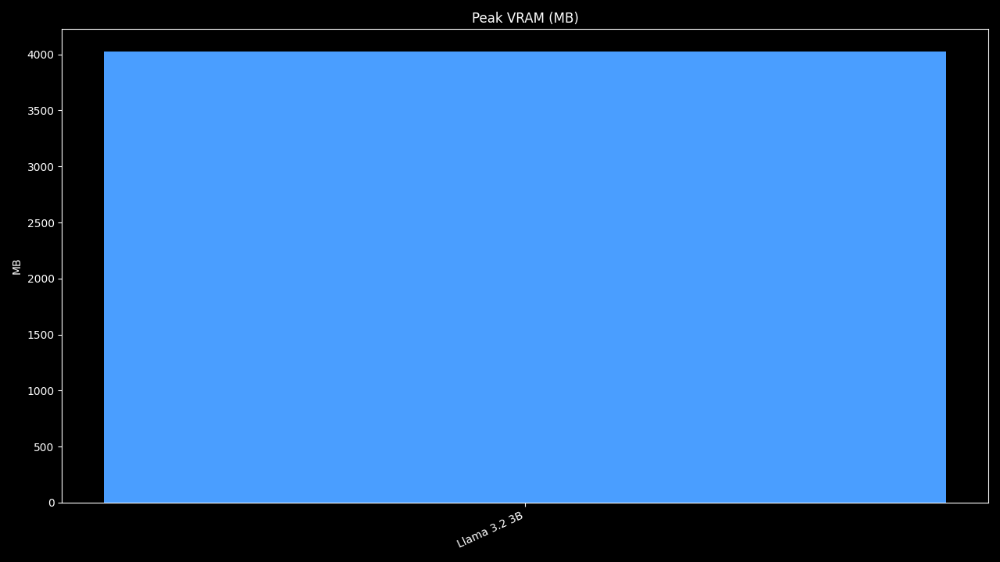
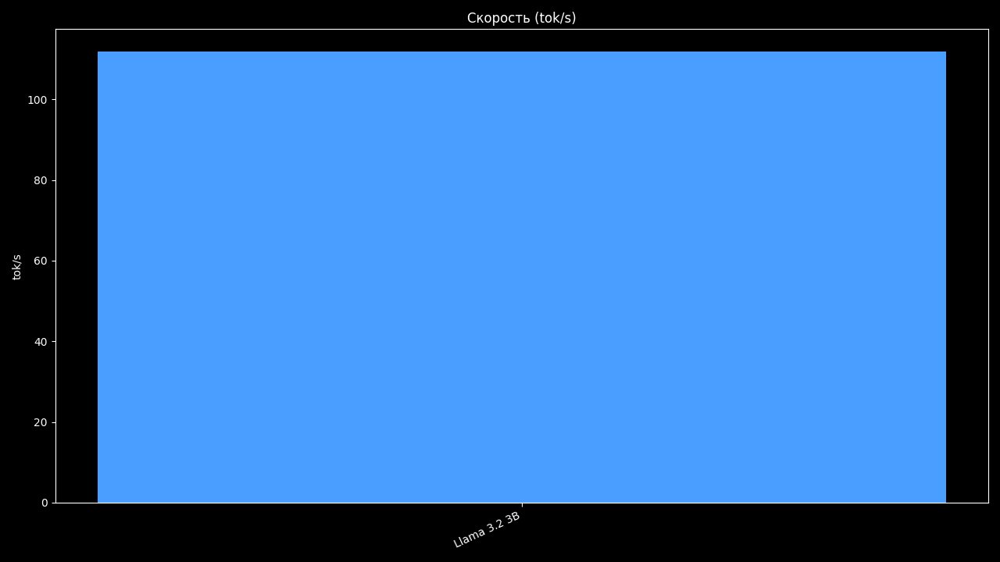

# AI Toolkit

Production-oriented AI applications built around local models, human review, measurable outputs, and practical deployment.



This curated monorepo contains nine independent working projects:

| Project | What it does | Stack |
| --- | --- | --- |
| [МАТНОРМ / MCC](projects/MCC) | Vertical slice: vision-LLM + STEP geometry + deterministic norms + Excel addin + RAG scaffold | FastAPI, Ollama, cadquery, Office.js |
| [Task Feasibility](projects/task-feasibility) | Routes technical tasks, applies safety guardrails, estimates cost, and generates an implementation brief | FastAPI, LangGraph, React |
| [Local LLM Channel](projects/local-llm-channel) | Benchmarks Ollama models and turns results into reviewed Telegram content | Python, Ollama, SQLAlchemy |
| [Neuropoligon](projects/neuropoligon) | Teaches AI concepts through interactive cross-platform lessons | Kotlin Multiplatform, Compose |
| [Impossible Travel](projects/impossible-travel) | Orchestrates a virtual travel-content studio with generation and review stages | Next.js, FastAPI, Celery |
| [KTO AI Rewriter](projects/kto_ai_rewriter_electron_portable_v4_3_ubuntu_build) | Portable AI rewriting editor with admin-managed providers and Electron packaging scripts | Node.js, Electron |
| [CED](projects/CED) | Catalog/document processing platform with web, desktop, backend, and AI-agent components | FastAPI, Vue, .NET |
| [AI-MATNORM](projects/ai_matnorm_greenfield_cursor) | Technologist assistant for construction-document analysis, OCR/LLM processing, and material norms | FastAPI, Vue, Tauri |
| [NTI.Sbor](projects/НТИ) | Android-first app for collecting actual labor intensity of manufacturing operations | Kotlin, Compose, FastAPI |

## Why These Projects

This is intentionally not a collection of isolated notebooks. Selected projects have defined user flows, reproducible setup, meaningful module boundaries, and either automated tests or cross-platform build tasks.

Common engineering themes:

- local-first inference with optional cloud providers;
- explicit human review before publishing or acting on generated content;
- safety and feasibility checks around LLM workflows;
- observable outputs such as benchmark scores, throughput, and cost;
- deployable services instead of one-off scripts.

## Visual Example

The Local LLM Channel records VRAM usage and throughput while benchmarking models through Ollama. These charts are generated by the application itself.

| VRAM profile | Token throughput |
| --- | --- |
|  |  |

## Quick Start

```bash
git clone https://github.com/lemiuji-boop/ai-toolkit.git
cd ai-toolkit
```

For the smallest full-stack demo:

```bash
cd projects/task-feasibility
cp .env.example .env
docker compose up --build
```

For a local LLM benchmark:

```bash
cd projects/local-llm-channel
uv sync --all-extras
cp .env.example .env
uv run python cli.py init-db
uv run python cli.py run-bench --model llama3.2:3b --suite general_ru
```

See each project README for prerequisites and detailed commands. A technical overview is available in [docs/PROJECTS.md](docs/PROJECTS.md).

## Repository Layout

```text
ai-toolkit/
├── projects/
│   ├── task-feasibility/
│   ├── local-llm-channel/
│   ├── neuropoligon/
│   ├── impossible-travel/
│   ├── kto_ai_rewriter_electron_portable_v4_3_ubuntu_build/
│   ├── CED/
│   ├── ai_matnorm_greenfield_cursor/
│   ├── MCC/
│   └── НТИ/
├── docs/
└── .github/workflows/
```

## Quality and Security

- Runtime secrets belong in local `.env` files and are never committed.
- Generated content, local databases, caches, dependencies, and build outputs are excluded from version control.
- Source files use Apache 2.0 license headers.

## License

Copyright 2026 Rinat Ishmaev. Licensed under the [Apache License 2.0](LICENSE).
