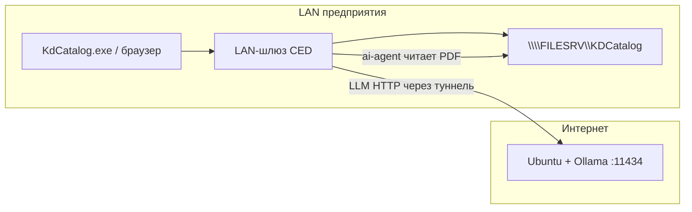

# CED: LAN-шлюз + ИИ на внешней Ubuntu через туннель

> **Устарело (2026).** Новые установки: **[ubuntu-single-server.md](./ubuntu-single-server.md)** — один Ubuntu, без туннеля и без Windows-шлюза.

> Архив: portable-шлюз — **[windows-gateway-bundle.md](./windows-gateway-bundle.md)** · приёмка шлюза — **[acceptance-gateway-checklist.md](./acceptance-gateway-checklist.md)**

Сценарий, когда:

- **Внешняя Ubuntu** (интернет есть, **доступа в LAN предприятия нет**) — GPU, Ollama, тяжёлые LLM-запросы.
- **Шлюз в LAN** (интернет + локальная сеть) — каталог КД (UNC), PostgreSQL, API, пользователи, WinForms-клиенты.
- PDF **никогда не покидают LAN**, если не настроена явная передача байтов (см. ограничения ниже).

---

## Рекомендуемое разделение (работает с текущим кодом)

| Компонент | Где | Зачем |
|-----------|-----|--------|
| PostgreSQL, Redis | **LAN-шлюз** | данные каталога |
| `backend`, Celery, nginx, `www` | **LAN-шлюз** | API и веб для пользователей |
| **`ai-agent`** | **LAN-шлюз** | читает PDF по `file_path` с монтированной шары |
| OCR, штампы, таблицы (PyMuPDF и т.д.) | **LAN-шлюз** (внутри `ai-agent`) | нужен доступ к файлу на диске |
| **Ollama** (LLM) | **Внешняя Ubuntu** | GPU, без доступа к LAN |
| Туннель | **LAN → Ubuntu** | только порт Ollama (11434) |

Почему так: сейчас backend вызывает `POST /analyze` с полем **`file_path`**, а не файлом. Агент открывает PDF **локально**. Путь `\\FILESRV\...` или `/mnt/kdcatalog/...` виден только на LAN-шлюзе.



### Поток обработки INBOX

1. Celery на LAN-шлюзе видит файл в `_INBOX`.
2. `ai-agent` на LAN-шлюзе: OCR/штамп/NER локально.
3. Для LLM — запрос на `http://127.0.0.1:11434` (локальный конец SSH/VPN-туннеля на Ubuntu).
4. Результат в PostgreSQL, файл переносится в `catalog` — всё на LAN.

---

## Схема сети (логическая)

```
  [ПК пользователей] ──LAN──► [LAN-ШЛЮЗ: CED + ai-agent + БД]
                                    │
                                    ├──SMB──► [FILES] \\share\KDCatalog
                                    │
                                    └──туннель (исходящий с шлюза)──► [Ubuntu: Ollama]
                                              только TCP 11434 (или 443 через TLS)
```

**В LAN не открывают** порты наружу. Инициатор туннеля — **LAN-шлюз** (исходящее соединение в интернет).

---

## LAN-шлюз: что поднять

На машине **внутри сети предприятия** — у вас **Windows без админа** (portable CED-Server) или Linux с Docker:

```bash
# пример Linux + Docker
docker compose -f docker-compose.yml -f docker-compose.lan.yml up -d --build
```

Сервисы в compose: `postgres`, `redis`, `backend`, `celery-worker`, `celery-beat`, **`ai-agent`**, `nginx`.

`.env` на шлюзе:

```env
APP_ENV=production
DEBUG=false

CATALOG_ROOT=/mnt/kdcatalog          # смонтированная UNC-шара
FILE_STORAGE_ROOT=/data/storage

# ai-agent в том же compose — локально
AI_AGENT_BASE_URL=http://ai-agent:8001
AI_AGENT_API_KEY=общий-секрет

# для ai-agent: откуда брать настройки провайдера
BACKEND_INTERNAL_URL=http://backend:8000

# Ollama — через туннель на localhost шлюза
# (в веб-UI: Настройки → ИИ-провайдеры → base_url)
# http://127.0.0.1:11434
```

Монтирование шары — см. [lan-enterprise.md](./lan-enterprise.md) (CIFS → `/mnt/kdcatalog`).

Пользователи: `http://lan-gateway:8000` (клиент), `http://lan-gateway/` (веб).

---

## Внешняя Ubuntu: только Ollama

```bash
# на Ubuntu с GPU, без маршрута в LAN
curl -fsSL https://ollama.com/install.sh | sh
sudo systemctl enable ollama
ollama pull qwen2.5-coder

# слушать только localhost (безопаснее)
# в systemd или OLLAMA_HOST=127.0.0.1:11434
```

Не публикуйте `11434` в интернет без TLS и firewall — доступ только через туннель.

---

## Туннель LAN-шлюз → Ubuntu

Принцип: **только исходящее** соединение с шлюза в интернет. Ubuntu **не подключается** в LAN.

В CED провайдер Ollama всегда: **`http://127.0.0.1:11434`** (локальный конец туннеля на шлюзе).

---

### Windows-шлюз **без прав администратора** (рекомендуется для вас)

Ничего не ставится в систему: portable-файлы в папке `CED-Server\tunnel\`, запуск из `start-server.bat`.

| Можно | Нельзя без админа |
|-------|-------------------|
| `plink.exe` в папке проекта | Установка Tailscale / WireGuard |
| `ssh.exe`, если уже есть в PATH | `netsh portproxy`, службы Windows |
| `frpc.exe` + `frpc.ini` в `tunnel\` | OpenSSH Server на Windows |
| Ярлык в `%APPDATA%\...\Startup` | Изменение брандмауэра (если GPO запрещает) |

**Шаги**

1. Соберите/скопируйте `CED-Server` (см. `build/windows/`).
2. Скачайте **один файл** [plink.exe](https://www.chiark.greenend.org.uk/~sgtatham/putty/latest.html) → `CED-Server\tunnel\plink.exe`.
3. На **Ubuntu**: пользователь `cedtunnel`, Ollama на `127.0.0.1:11434`, в `authorized_keys` — публичный ключ (отдельный `tunnel\id_ed25519`, создаётся на Windows командой `ssh-keygen -t ed25519 -f tunnel\id_ed25519` **без админа**).
4. `copy tunnel.env.example tunnel.env` — укажите `TUNNEL_HOST`, `TUNNEL_USER`, `TUNNEL_KEY_FILE`.
5. `start-server.bat` — поднимет туннель, затем API и worker.
6. `health-check-ollama.bat` — проверка `http://127.0.0.1:11434/api/tags`.

Пример `tunnel.env`:

```ini
TUNNEL_ENABLED=1
TUNNEL_HOST=203.0.113.50
TUNNEL_USER=cedtunnel
TUNNEL_PORT=22
TUNNEL_MODE=plink
TUNNEL_KEY_FILE=tunnel\id_ed25519
```

Подробно: `build/windows/tunnel/README.md`.

**Политики предприятия:** если запрещён любой неизвестный `.exe`, попросите IT **разрешить** только `plink.exe`/`frpc.exe` из папки CED или добавить в whitelist; альтернатива — встроенный `ssh.exe` (`TUNNEL_MODE=ssh`), если feature уже включена на всех ПК.

**Исходящий TCP 22** (или порт frp на Ubuntu) должен быть разрешён **файрволом на выход** для учётной записи пользователя — это обычно не требует админа на самом ПК.

---

### Linux-шлюз (если позже появится root)

```bash
autossh -M 0 -N \
  -o ServerAliveInterval=30 \
  -L 127.0.0.1:11434:127.0.0.1:11434 \
  cedtunnel@UBUNTU_PUBLIC_IP
```

---

### frp без SSH (только portable exe на Windows)

На **Ubuntu**: `frps` + `frpc` с секцией `stcp` для Ollama (см. `build/windows/tunnel/frpc.ini.example`).
На **Windows**: `tunnel\frpc.exe`, `TUNNEL_MODE=frpc` в `tunnel.env`.
Тоже **без установки**, только exe в папке CED.

---

### Не подходит для Windows без админа

- **Tailscale / WireGuard** — установка драйвера.
- **Reverse SSH на Windows** — нужен sshd (админ).
- Публикация Ollama на `0.0.0.0` в интернет без шифрования.

---

## Безопасность

| Риск | Мера |
|------|------|
| PDF в интернет | При рекомендуемой схеме PDF **не уходят** на Ubuntu — только текст/промпты в Ollama |
| Открытый Ollama в WAN | Слушать `127.0.0.1`, доступ только по туннелю |
| Перехват туннеля | SSH или WireGuard/Tailscale; для compliance — VPN с TLS |
| Слабые ключи | `JWT_*`, `AI_AGENT_API_KEY` — уникальные, не из `.env.example` |

Текст фрагментов PDF уходит в LLM на Ubuntu — учитывайте политику ИБ (объём, логирование Ollama).

---

## Альтернатива: весь `ai-agent` на Ubuntu (не рекомендуется без доработки)

Если перенести **`ai-agent` на внешнюю Ubuntu**:

1. Нет доступа к `file_path` на шаре — **нужно менять API**: передавать PDF байтами (`multipart`) с LAN-шлюза.
2. `ai-agent` вызывает `BACKEND_INTERNAL_URL/internal/ai-provider` — нужен **обратный туннель** Ubuntu → LAN backend.
3. PDF **покидают контур предприятия** — отдельное согласование ИБ.

Текущая версия CED этого **не поддерживает** из коробки. Для вашего ТЗ достаточно схемы «агент в LAN + Ollama по туннелю».

---

## Где что считать (гибкое разделение)

| Этап | LAN-шлюз | Ubuntu |
|------|----------|--------|
| Чтение PDF с шары | да | нет |
| OCR / штамп / таблицы | да (ai-agent) | опционально* |
| LLM (NER, уточнение полей) | прокси-запрос | да (Ollama) |
| БД, каталог, API | да | нет |

\* Перенос OCR на Ubuntu потребует отправки файла — см. альтернативу выше.

---

## Чеклист

**LAN-шлюз (Windows без админа)**

- [ ] Папка `CED-Server` в профиле или на разрешённой шаре
- [ ] Доступ к UNC `\\FILESRV\KDCatalog` у **этой** учётной записи Windows
- [ ] `tunnel\plink.exe` + `tunnel.env`, ключ SSH на Ubuntu
- [ ] `start-server.bat` / ярлык в Startup пользователя
- [ ] `health-check-ollama.bat` → OK
- [ ] В веб-UI провайдер: `http://127.0.0.1:11434`
- [ ] Пользователи: `http://<IP-этого-PC>:8000` (брандмауэр Windows может спросить разрешение при **первом** запуске exe — пользователь нажимает «Разрешить», админ не нужен)

**Внешняя Ubuntu**

- [ ] Ollama + модель
- [ ] SSH/WireGuard/Tailscale
- [ ] Firewall: нет прямого доступа в LAN

**Клиенты Windows**

- [ ] `KdCatalog.exe`, `ServerUrl` = `http://LAN-шлюз:8000`, без прав админа

---

## Связанные документы

- [lan-enterprise.md](./lan-enterprise.md) — пользователи, UNC, клиенты без админа
- [windows.md](./windows.md) — сборка EXE, если шлюз на Windows
