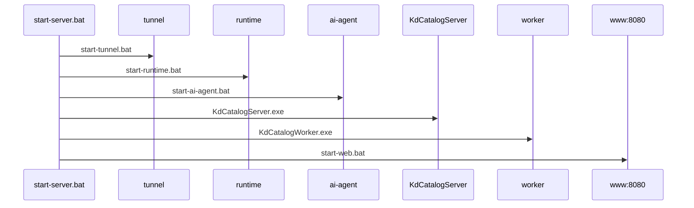

# CED: portable-шлюз Windows (LAN + туннель к Ollama)

> **Устарело (2026).** Новые установки: **[ubuntu-single-server.md](./ubuntu-single-server.md)** — один Ubuntu-сервер, клиенты Windows без шлюза.

Полный пакет **CED-Server** на Windows **без прав администратора**: PostgreSQL, Redis, API, Celery, ai-agent, туннель к внешней Ubuntu, веб для модераторов.

Связанные документы:

- [lan-split-ai-tunnel.md](./lan-split-ai-tunnel.md) — логика туннеля и Ubuntu
- [lan-enterprise.md](./lan-enterprise.md) — клиенты и UNC
- [acceptance-gateway-checklist.md](./acceptance-gateway-checklist.md) — приёмка

---

## Матрица портов

| Порт | Служба | Доступ |
|------|--------|--------|
| 5432 | PostgreSQL (portable) | localhost |
| 6379 | Redis (portable) | localhost |
| 8000 | API (`KdCatalogServer.exe`) | LAN (desktop + веб API) |
| 8001 | ai-agent (`KdCatalogAiAgent.exe`) | localhost |
| 8080 | Статика веб (`start-web.bat`) | LAN (модераторы) |
| 11434 | Ollama (через туннель) | localhost на шлюзе |

---

## Состав `dist\CED-Server`

```
CED-Server\
  KdCatalogServer.exe
  KdCatalogWorker.exe
  KdCatalogAiAgent.exe
  .env                    # из env.gateway.example
  tunnel.env              # опционально
  www\                    # Vue build (mode lan)
  runtime\                # postgres, redis (бинарники — см. runtime/README.md)
  tunnel\                 # plink.exe, ключи
  logs\
  start-server.bat        # полная цепочка
  stop-server.bat
  init-runtime.bat
  setup-tunnel.bat
  health-check.bat
  health-check-ollama.bat
```

---

## Порядок первого запуска

1. Скопировать `CED-Server` в `C:\Users\<user>\CED\` (или разрешённую шару).
2. Положить `plink.exe` в `tunnel\` (см. `tunnel/README.md`).
3. `setup-tunnel.bat` — ключ SSH, настроить `tunnel.env`.
4. Скачать runtime по `runtime/README.md`, затем `init-runtime.bat`.
5. `copy env.gateway.example .env` — указать `CATALOG_ROOT=\\FILESRV\KDCatalog`, JWT.
6. `start-server.bat`.

Проверки:

```bat
health-check.bat
health-check-ollama.bat
```

---

## Порядок запуска (`start-server.bat`)



---

## Адреса для пользователей

| Роль | Инструмент | URL |
|------|------------|-----|
| user / moderator | `KdCatalog.exe` | `http://<IP-шлюза>:8000` |
| moderator / admin | Браузер | `http://<IP-шлюза>:8080` |

Вход: учётки из БД; `admin`/`admin` только на стенде — смена пароля обязательна.

---

## UNC каталога КД

- `CATALOG_ROOT=\\FILESRV\KDCatalog` в `.env`
- Учётная запись, под которой запускается `start-server.bat`, должна иметь **чтение/запись** на `_INBOX` и `catalog`
- Клиентам `CatalogUnc` указывать **не нужно** (режим `client`)

---

## Сбой туннеля

- OCR/штампы продолжают работать на шлюзе
- LLM-шаг пропускается, в мониторинге — предупреждение
- `health-check-ollama.bat` → ошибка; перезапуск: `start-tunnel.bat`

---

## GPO / ограничения

| Симптом | Действие |
|---------|----------|
| Запрещён `postgres.exe` / `redis-server.exe` | Whitelist IT или в `.env` указать URL корпоративных PG/Redis |
| Запрещён `plink.exe` | `TUNNEL_MODE=ssh` если есть `ssh.exe`, иначе frp |
| Брандмауэр Windows | При первом запуске — «Разрешить» для частной сети (без админа) |

---

## Сборка пакета (на Windows с SDK)

```powershell
Set-ExecutionPolicy -Scope Process Bypass
.\build\windows\build-all.ps1
cd web_client
npm run build -- --mode lan
```

Артефакт: `dist\CED-Server\`.
