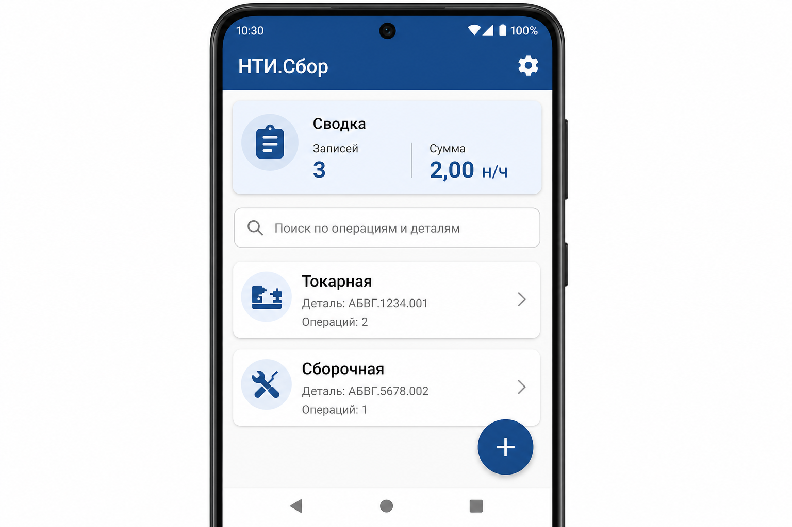
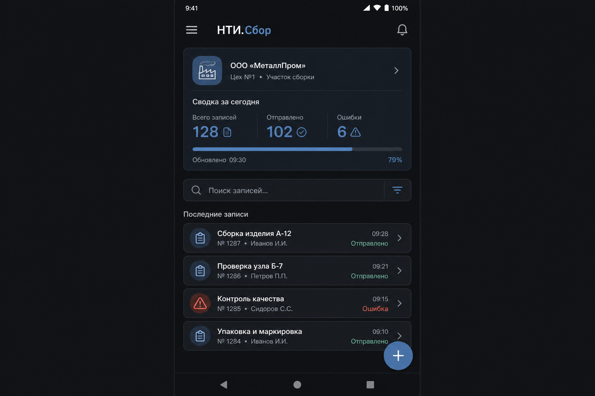
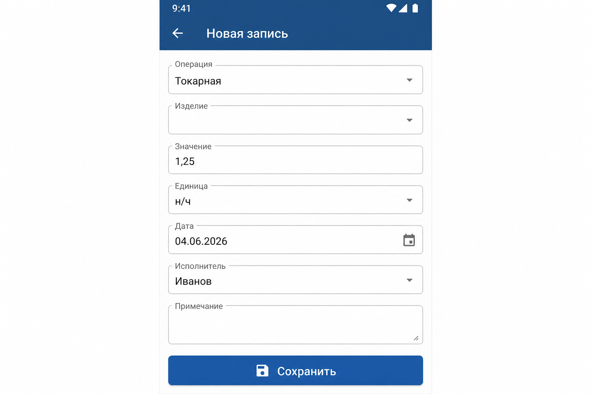
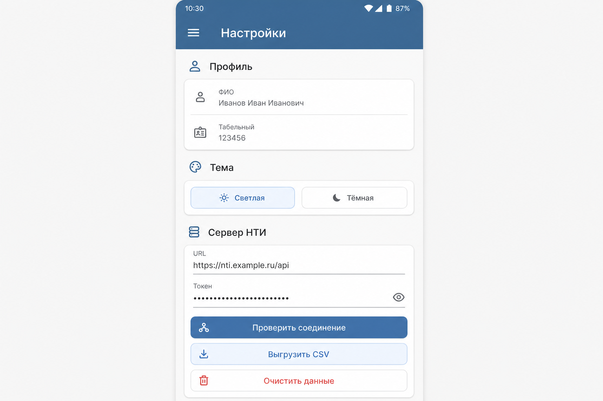

# Согласование дизайна НТИ.Сбор

## Статус

| Поле | Значение |
|------|----------|
| Версия макетов | 1.0-mockup |
| Дата предъявления | 04.06.2026 |
| **Утверждено заказчиком** | **НЕТ** (ожидает подписи) |

## Визуализация для подписания

| Демо на телефоне | Сборка | Оформление | Функции |
|------------------|--------|------------|---------|
| **НТИ.Сбор 1** | `v1` | Макет 1: светлый главный | Полное приложение (БД, запись, поиск, CSV, sync) |
| **НТИ.Сбор 2** | `v2` | Макет 2: тёмный дашборд | Полное приложение |
| **НТИ.Сбор 3** | `v3` | Макет 3: форма записи | Полное приложение + стиль формы |
| **НТИ.Сбор 4** | `v4` | Макет 4: настройки | Полное приложение + стиль настроек |

Установка: `android/scripts/install_demo_all.sh`

Ниже — примеры экранов (акцент `#1C4F80`, Material 3, крупные элементы под цех).

### 1. Главный экран — светлая тема



Сводка, поиск, список записей, FAB «+», статус синхронизации.

### 2. Главный экран — тёмная тема



### 3. Форма записи



Операция, изделие, значение, единица (н/ч), дата, исполнитель, «Сохранить».

### 4. Настройки



Профиль, тема, сервер НТИ, синхронизация, экспорт CSV, очистка данных.

---

## Интерактивные макеты (точное соответствие коду)

В Android Studio откройте `DesignMockupPreviews.kt` → группа превью **signoff**:

| Превью | Файл |
|--------|------|
| 01–05 | [`android/app/src/main/java/ru/nti/sbor/ui/preview/DesignMockupPreviews.kt`](../android/app/src/main/java/ru/nti/sbor/ui/preview/DesignMockupPreviews.kt) |

Экспорт PNG: см. [`design/MOCKUP_EXPORT.md`](design/MOCKUP_EXPORT.md).

Установленное приложение (dev): `./gradlew :app:installDevDebug` — для проверки на реальном устройстве.

## Чек-лист заказчика

- [ ] Главный экран: список, сводка, поиск, FAB
- [ ] Форма записи: поля и валидация
- [ ] Настройки: профиль, тема, сервер, экспорт
- [ ] Светлая и тёмная тема (макеты 1–2)
- [ ] Читаемость при масштабе шрифта 200% (превью `05` в Studio)

**Замечания заказчика:**

```
(свободное поле)
```

**Подпись заказчика:** _________________ **Дата:** _________

> После утверждения замените «НЕТ» на «ДА» и укажите дату.
